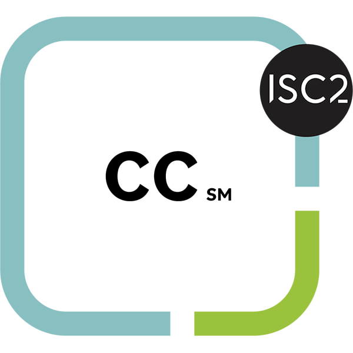

<h1 align="center">Hi, I'm Faisal a.k.a XOR1</h1>
<h3 align="center">| Cyber Security Analyst | CTF Player | Blue Teamer | SOC Analyst | DFIR | Threat Hunting |</h3>

---

## Certifications:

    
    
    

---

## Connect with me:

<!--  -->

<!-- 
 -->

---

## Language and Tools

   </a>    <a href="https://www.linux.org/" target="_blank" rel="noreferrer">   

---

## GitHub Stats:

---

- Reach me at:

 **faisalfarooq17121@gmail.com**

---
