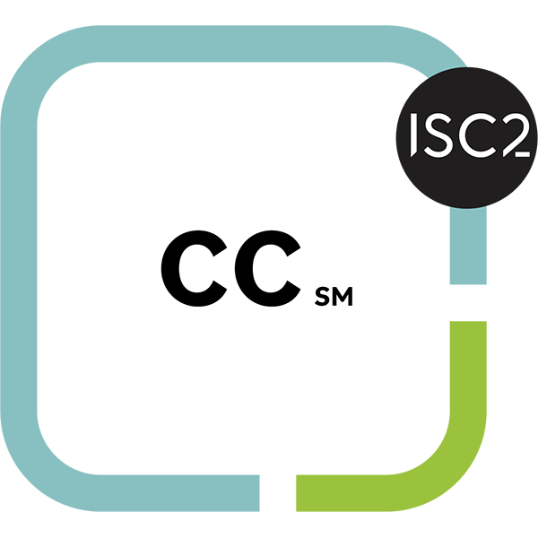

<h1 align="center">💎 Faisal Farooq (XOR1)</h1>

🔴 Offensive Security • Red Teaming • Pentesting • Application Security • CTF

---

# 🧠 About Me

🔴 Offensive Security enthusiast passionate about **breaking systems to build stronger ones.**

I focus on identifying vulnerabilities across **web applications, networks, and infrastructure** while continuously sharpening my skills through **CTFs, research, and hands-on security testing.**

### 🔍 Areas of Interest

⚔️ Red Team Operations
🌐 Web Application Security
🧪 Vulnerability Research
💣 Exploit Development
🔐 Application Security
🏴 Capture The Flag (CTF)

---

# 🏆 Certifications

---

# ⚔️ Offensive Security Arsenal

---

# 🛠 Tools I Use

---

# 📊 GitHub Stats

---

# 🔥 GitHub Contribution Streak

---

# 🧠 TryHackMe

---

# 🌐 Connect With Me

---

# 📫 Contact

📧 **[faisalfarooq17121@gmail.com](mailto:faisalfarooq17121@gmail.com)**

---

# ⚠️ Disclaimer

All tools, scripts, and techniques shared here are strictly for **educational purposes and authorized security testing only.**

---

💎 *"Break the system. Understand the system. Secure the system."*

